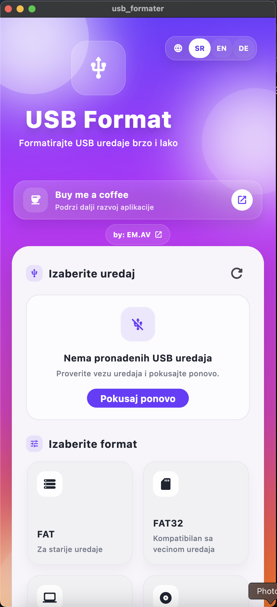
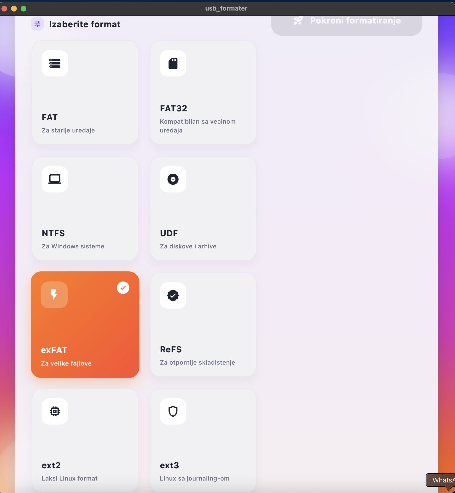
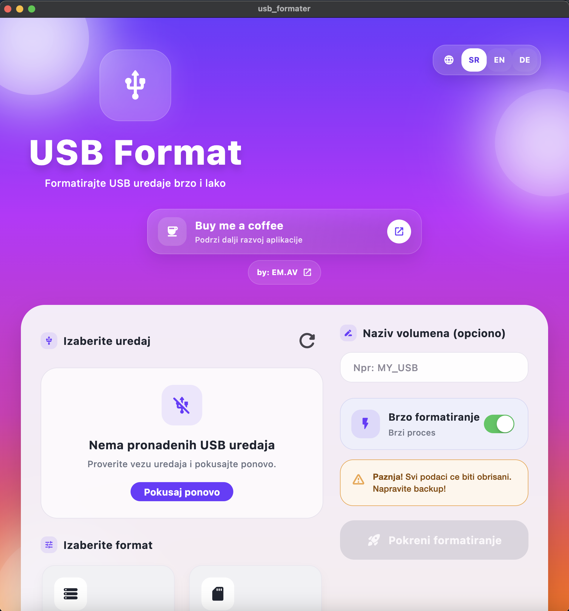

# Flutter USB Format (Android, OSX, Windows)

Premium Flutter project for a modern USB formatting experience on desktop and mobile.

`USB Format` is an open-source Flutter app with a polished Material 3 interface, desktop-first responsive layout, localization support, and a safe formatting flow simulation designed for future real-device expansion.

## Downloads

<p align="center">
  <a href="https://github.com/qwerty684/USB_Formater/releases/latest/download/USB-Format-macOS.dmg">
    
  </a>
  <a href="https://github.com/qwerty684/USB_Formater/releases/latest/download/USB-Format-macOS-app.zip">
    
  </a>
  <a href="https://github.com/qwerty684/USB_Formater/releases/latest/download/USB-Format-android.apk">
    
  </a>
</p>

<p align="center">
  <a href="https://github.com/qwerty684/USB_Formater/releases">
    View all releases
  </a>
</p>

## Support the Project

If you like this project and want to support future updates, you can buy me a coffee here:

- PayPal: [paypal.me/avdoviic](https://paypal.me/avdoviic)

## Creator

Created by `EM.AV`

- Fiverr: [fiverr.com/emiravdovic](https://www.fiverr.com/emiravdovic)
- Instagram: [@em.av](https://www.instagram.com/em.av/)
- PayPal: [paypal.me/avdoviic](https://paypal.me/avdoviic)

## Preview

<p align="center">
  
</p>

<p align="center">
  
  
</p>

## Features

- Modern Material 3 UI with premium gradients, soft shadows, and responsive spacing
- Desktop-optimized layout for macOS and Windows
- Mobile-friendly layout for Android and iOS
- Localization support for Serbian, English, and German
- Real connected USB / external drive discovery on macOS desktop
- Safe formatting flow simulation with progress states and confirmation dialogs
- Quick format toggle, volume name validation, and feedback messages
- Riverpod-based state management
- Clean and scalable Flutter project structure

## Supported File Systems

The current UI and formatting flow support these file system profiles:

- `FAT`
- `FAT32`
- `NTFS`
- `UDF`
- `exFAT`
- `ReFS`
- `ext2`
- `ext3`

## Current Status

This project is safe to explore and extend, but there is one important note:

- Real disk formatting is **not implemented yet**
- The current formatting process is simulated for UX, testing, and future development
- Real connected device detection currently works on `macOS desktop`
- On web, Android, and iOS, direct access to connected storage devices is limited by platform sandbox rules

If you want to turn this into a real formatter, the next step is adding native formatting logic for macOS and Windows.

## Tech Stack

- Flutter
- Material 3
- Flutter Riverpod
- macOS native integration for connected device discovery
- Responsive desktop + mobile UI architecture

## Project Structure

```text
lib/
  app/
  core/
  features/
    usb_format/
  l10n/
assets/
  icons/
  images/
docs/
  previews/
```

## Getting Started

### Requirements

- Flutter `3.x`
- Dart `3.x`
- macOS, Windows, Linux, Android SDK, or Xcode depending on your target platform

### Install

```bash
flutter pub get
```

### Run

```bash
flutter run -d macos
```

You can also run it on other supported Flutter targets:

```bash
flutter run -d windows
flutter run -d android
flutter run -d ios
flutter run -d chrome
```

## Why This Project

USB Format is meant to be a clean starting point for developers who want:

- a modern USB / drive utility UI
- a cross-platform Flutter desktop project
- a polished open-source base for storage tooling
- a ready-made Riverpod + Material 3 architecture


## Contributing

Issues, ideas, UI improvements, platform support, and PRs are welcome.

If you extend the real formatting layer or add native Windows support, feel free to open a pull request.

## License

This repository does not include a license file yet.

If you plan to publish it publicly as reusable open source, add a license such as `MIT` before release.
